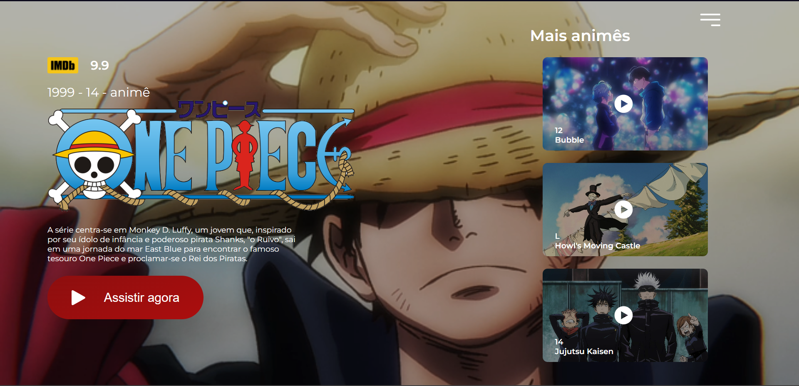

## Hey Dev! 😄

### 🏗️ Projeto:

> Anime+.

[🔗 Link para acessar a página](https://anime-plus.vercel.app/)

#### 🎃 Prévia:

### 🎯 Objetivo:

> Práticar de forma avançada os conhecimentos em HTML5 e CSS3.

#### ✏️ Descrição:

> A proposta foi feita pelo Desenvolvedor Front-end e Educador da Rocketseat, <a href="https://github.com/birobirobiro">birobirobiro</a>. Foi apresentado como um desafio em live e eu achei super interessante a ideia, por isso "coloquei a mão na massa" (ou nesse caso, no teclado) e dei o meu melhor em cada linha.

> Ainda estou iniciando, então foi muito importante colocar meus conhecimentos em prática, pretendo continuar assim e, em um futuro próximo, ser uma ótima programadora web/Dev Front-end.

> Estou aberta a sugestões de como posso melhorar tanto este, quanto os outros projetos em meu GitHub!

#### ⚙️ Tecnologias usadas:

> HTML5;

> CSS3;

#### O projeto original:

[📂 Repositório](https://github.com/birobirobiro/live-twitch-disney-plus-redesign)

[👨‍💻 Perfil do criador](https://github.com/birobirobiro)

## Colaboradores:

    
    Index-evelin

